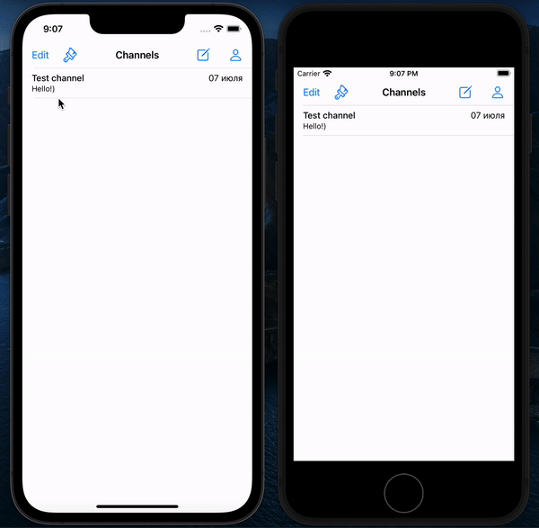

# Chat-app

The application was created as part of studying at Tinkoff Fintech School.

## Preview




## Installation

Open the main directory in the terminal and run the following command.
After installing the necessary dependencies, open Chat-App.xcworkspace.

```
pod install
```
## Technologies

- UIKit + Autolayout
- MVC + SOA
- URLSession, Firebase
- Operation, GCD
- UserDefaults, CoreData, NSFetchedResultsController
- Cocoapods
